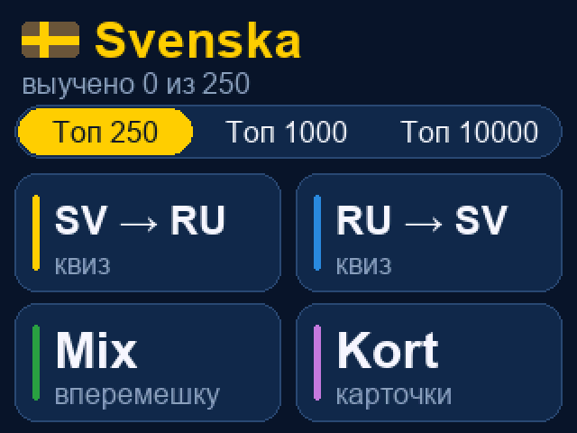
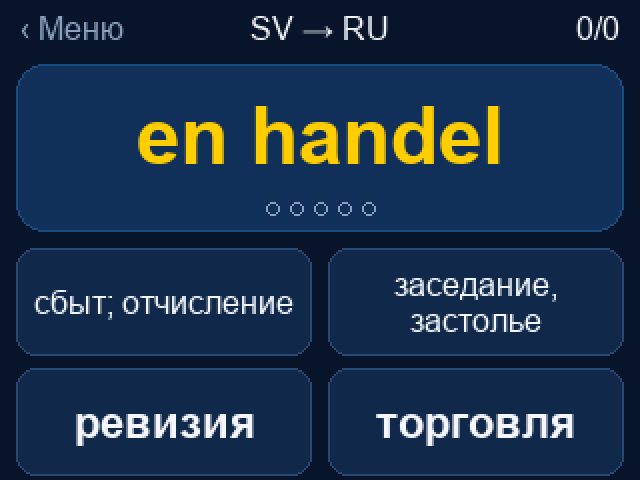
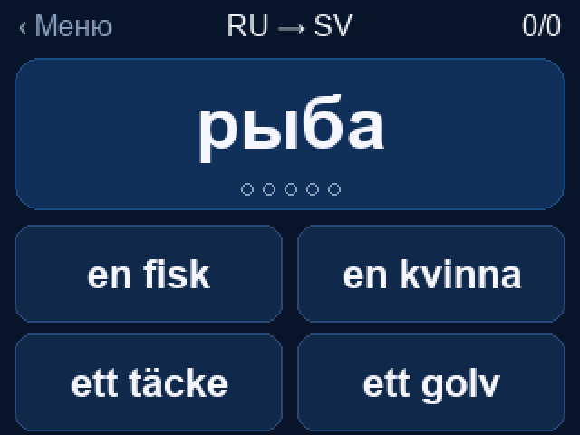
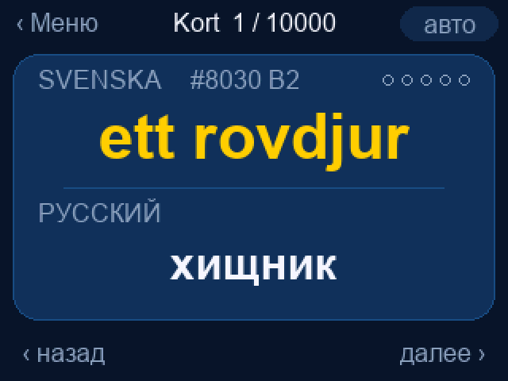

# m5svenska

Карманный тренажёр шведских слов для **M5Stack CoreS3 / CoreS3 Lite (SE)**.
Управление полностью с сенсорного экрана 320×240, без Wi‑Fi и внешних сервисов.

| Меню | Квиз SV → RU | Квиз RU → SV | Карточки |
|---|---|---|---|
|  |  |  |  |

## Режимы

Сверху в меню — переключатель словаря: **Топ 250 / Топ 1000 / Топ 10000**.
В квизе и карточках участвуют только первые N самых частотных слов. Выбор
запоминается.

- **SV → RU** — сверху шведское слово, снизу 4 варианта перевода на русский.
- **RU → SV** — сверху русское слово, снизу 4 шведских варианта.
- **Mix** — направление выбирается случайно для каждого вопроса.
- **Kort (карточки)** — слово сразу показано на обоих языках. Тап по левой трети
  экрана — назад, по остальной части — дальше. Кнопка «авто» листает карточки
  сама каждые 4 секунды (полоска внизу показывает время до следующей).

В квизе после ответа правильный вариант подсвечивается зелёным, ошибочный — красным.
Следующий вопрос появляется сам (0,9 с после верного
ответа, 2,2 с после ошибки), тапом можно перейти сразу. Сверху справа — счёт
и серия (`×5`) верных ответов подряд.

## Как учит

- У каждого слова есть уровень 0–5 (точки под словом). Верный ответ поднимает
  уровень на 1, ошибка сбрасывает его в 0.
- Слово выбирается случайно с весом `(6 − уровень)²`: новые и забытые слова
  выпадают в ~36 раз чаще выученных. Последние 10 слов не повторяются.
- Варианты-ловушки берутся из той же части речи (сущ./глагол/прил./числа/прочее),
  а синонимы (например, *att bo* / *att leva* — «жить») никогда не попадают в
  варианты вместе, чтобы не было двух верных ответов.
- Прогресс хранится в NVS-флеше (4 бита на слово) и переживает перезагрузку.
  Он общий для всех уровней словаря. «Выучено» в меню — слова с уровнем ≥ 3
  среди текущего топа.
- На карточке показаны ранг слова по частоте (`#170`) и уровень CEFR (A1–C2),
  если он известен.

## Дизайн

Тёмно-синий фон и акценты цветов шведского флага: шведские слова — жёлтые,
русские — белые. Все тач-зоны не меньше 148×54 px. Шрифты — сглаженные (Arial
Bold 40/28/22 и Arial 16), сгенерированы в формат VLW с кириллицей, å/ä/ö/é.
Длинный текст сам уменьшается до следующего размера шрифта, а если не влезает —
переносится на две строки. Кадр рисуется в буфер в PSRAM, поэтому экран не мерцает.

Через 90 с без касаний подсветка гаснет до минимума; первый тап только будит экран.
Звука нет — динамик отключён.

## Словарь

10000 шведских слов, отсортированных по частоте, с переводом на русский:
существительные с артиклем (`en`/`ett`), глаголы с `att`, прилагательные,
наречия, предлоги, устойчивые выражения (`i alla fall`, `ta hand om`), числа.

Откуда взялись слова:

- [Kelly list](https://spraakbanken.gu.se/resurser/kelly) (Språkbanken, Гётеборгский
  университет) — 8425 лемм, отобранных для изучающих шведский, с уровнями CEFR и родом
  существительных.
- [Частоты лемм SALDO](https://svn.spraakbanken.gu.se/sb-arkiv/pub/frekvens/) по всем
  корпусам Språkbanken. По ним отсортирован весь список, и из них взяты слова, которых
  нет в Kelly.
- Мусор отсеян вручную: ошибки лемматизации, имена собственные, дубли вида
  `imorgon`/`i morgon`, грубая лексика.
- Русские переводы составлены с помощью Claude. Встречаются неточности, особенно
  в хвосте списка; правки приветствуются.

Файлы:

```
data/candidates.tsv   ранг, лемма, часть речи, род, CEFR — порядок зафиксирован
data/ru/*.tsv         переводы: ранг<TAB>перевод[<TAB>своё написание]
data/words.tsv        итоговый словарь (генерируется)
src/words.h           он же для прошивки (генерируется)
```

Поправить перевод — отредактировать строку в `data/ru/*.tsv`, затем:

```bash
python3 tools/gen_words.py   # пересобирает data/words.tsv и src/words.h
pio run -t upload
```

В строке перевода `-` выкидывает слово, префикс `en:`/`ett:`/`pl:` задаёт род
существительного. Третья колонка задаёт своё написание шведского слова
(например, `ska` вместо `att skola`). `tools/build_candidates.py` показывает, как
собирался `candidates.tsv` из Kelly и SALDO. Сам `candidates.tsv` не пересобирайте:
на его ранги ссылаются переводы.

Порядок слов в `words.h` — это индекс прогресса. Если словарь пересобрать с
другим числом слов, сохранённый прогресс сбросится.

## Сборка и прошивка

```bash
pio run                     # сборка
pio run -t upload           # прошивка (порт /dev/cu.usbmodem*)
```

Если порт не находится: зажать кнопку RESET ~3 с до зелёного светодиода
(режим загрузчика) и повторить.

### Шрифты

```bash
python3 tools/make_vlw.py "/System/Library/Fonts/Supplemental/Arial Bold.ttf" 40 font_b40 src/fonts/font_b40.h
```

Набор символов задан в `CHARSET` в `tools/make_vlw.py` (нужен Pillow).

### Отладка по serial (115200)

- `S` — снимок экрана: `SHOT 320 240\n` + сырой RGB565 (big-endian).
  `python3 tools/screenshot.py /dev/cu.usbmodemXXXX out.png` (нужен pyserial).
- `T x y` — эмуляция тапа в точку (x, y).
- Каждое реальное касание пишется в лог как `touch x y`.

## Структура

```
platformio.ini        конфигурация (board m5stack-cores3, M5Unified)
src/main.cpp          UI, логика квиза и карточек, прогресс
src/words.h           словарь (генерируется)
src/fonts/*.h         VLW-шрифты (генерируются)
tools/make_vlw.py     генератор шрифтов TTF → VLW
tools/screenshot.py   снимок экрана с устройства
tools/gen_words.py    сборка словаря из data/
tools/build_candidates.py  отбор кандидатов из Kelly + SALDO
data/                 исходные данные словаря
docs/*.png            скриншоты с реального устройства
```
